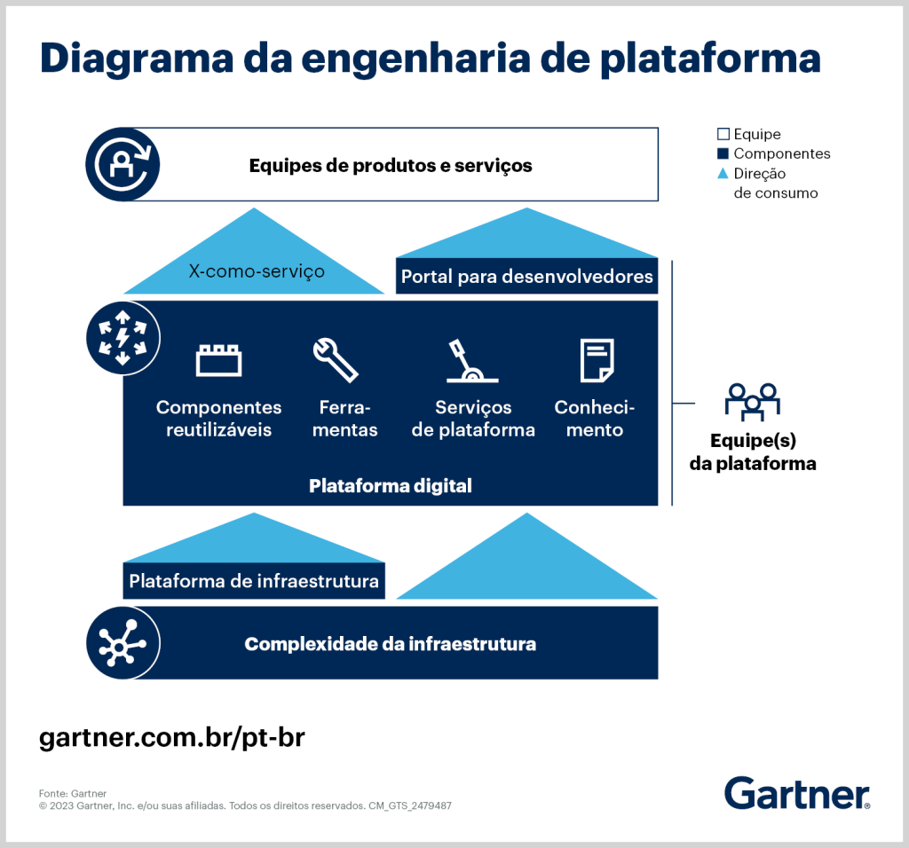
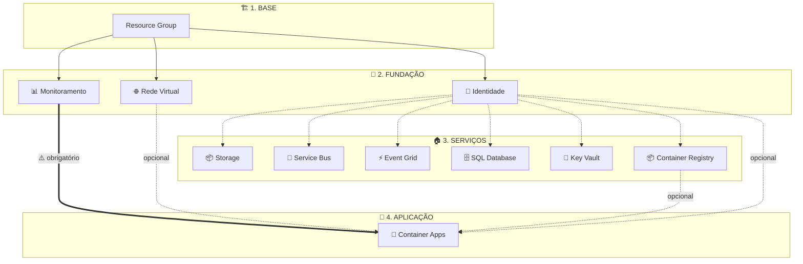
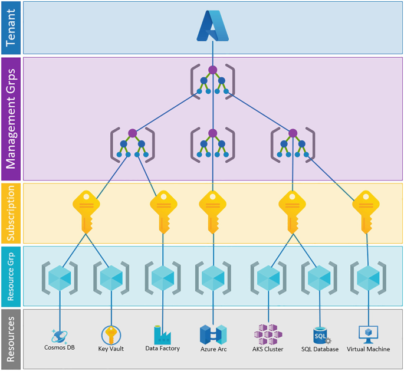
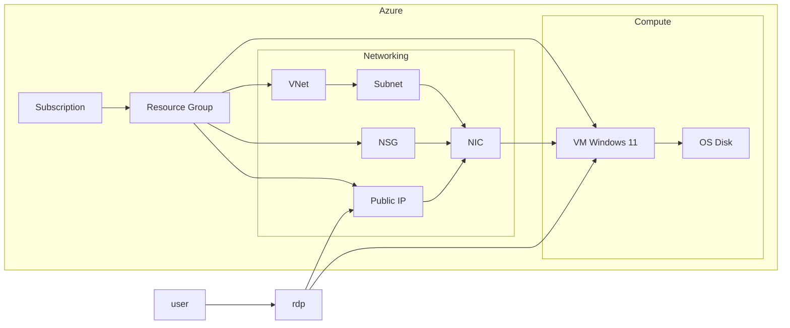

# Workshop DevOps Pro

> **Objetivo**: Construir uma plataforma completa no Azure usando Terraform + GitHub Actions com Vibe Coding (GitHub Copilot) — do zero ao deploy.

---

## O que é Engenharia de Plataforma?

Imagine que cada time de desenvolvimento precisa construir a própria casa antes de começar a morar nela — instalar encanamento, eletricidade, internet, alarme... **toda vez, do zero**. Isso é o que acontece quando não existe uma plataforma.

 O time de plataforma entrega a infraestrutura completa: rede, segurança, banco de dados, monitoramento. E os times de produto só precisam se preocupar com o que realmente importa: **o código do produto**.

### Por que usar?

| Problema sem plataforma | Solução com plataforma |
|------------------------|----------------------|
| Cada time configura infra do zero | Infra pronta em minutos com feature flags |
| Configurações inconsistentes entre times | Padrão único, seguro e auditável |
| Deploy manual e propenso a erros | Pipeline automatizada (CI/CD) |
| Semanas para subir um ambiente | Minutos para provisionar tudo |

### Na prática (o que vamos construir)

```
Dev pede um ambiente → Liga os feature flags → Terraform cria tudo → App roda em Container Apps
```

Tudo **automatizado**, **seguro** e **repetível**. O desenvolvedor não precisa saber como a rede funciona, ele só precisa saber o nome da imagem Docker.



---

## Arquitetura da Plataforma


---

---

## Step 1 — Criar a VM Windows no Azure



### 1.1 Criar Resource Group

**Portal** → Resource Groups → **Create**

| Campo | Valor |
|-------|-------|
| Subscription | `<SUA_SUBSCRIPTION>` |
| Resource group | `rg-workshop-vm` |
| Region | `East US 2` |

### 1.2 Criar a VM Windows 11

**Portal** → Virtual Machines → **Create** → Azure Virtual Machine

| Tab | Campo | Valor |
|-----|-------|-------|
| **Basics** | Resource group | `rg-workshop` |
| | Virtual machine name | `vm-workshop-win11` |
| | Region | `East US 2` |
| | Image | `Windows 11 Enterprise` |
| | Size | `Standard D8s v6 (8 vcpus, 32 GiB memory)` |
| | Administrator username | `rafael` |
| | Administrator password | `mS1+03t#u.N(` |
| **Networking** | Public inbound ports | `Allow selected ports` |
| | Select inbound ports | `RDP (3389)` |

## Arquitetura VM



### 1.3 Pegar IP publico

**Portal** → Virtual Machines → `vm-workshop-win11` → **Overview** → copiar **Public IP address**

aqui

### 1.4 Conectar via RDP

No Windows local:

1. Abrir **Remote Desktop Connection**
2. Computer: `<IP_PUBLICO>`
3. Username: `rafael`
4. Password: `mS1+03t#u.N(`

---
## Step 2 — Setup Git + VS Code + Copilot (Windows 11)

### 2.1 Instalar apps na VM (links oficiais)

- Git: https://git-scm.com/install/windows
- VS Code: https://code.visualstudio.com/download
- Docker Desktop: https://www.docker.com/products/docker-desktop/

### 2.1.1 Configurar WSL2 na VM (Windows 11)

No **PowerShell (Admin)**:

```powershell
wsl --install
```

> Esse comando habilita os componentes necessarios (Virtual Machine Platform, WSL) e instala o Ubuntu por padrao. **Reinicie a VM** apos a instalacao.

Apos reiniciar, abra o **Ubuntu** pelo menu Iniciar e configure usuario/senha.

### 2.2 Configurar Git (no terminal do Windows)

No **Terminal**:

```
git config --global user.name "Rafael Ferreira"
git config --global user.email "rafael.low1@gmail.com"
```

### 2.3 Instalar extensoes no VS Code

- GitHub Copilot Chat
- HashiCorp Terraform
- Microsoft Terraform

### 2.4 Instalar MCPs no VS Code

- Terraform
- Github Actions
- Microsoft Learn
- context7

#### Configuração dos MCPs

1. **Autenticar com GitHub**
2. **Iniciar os servidores MCP**
3. **Resolver erro do Terraform MCP**: 
   - O MCP Terraform pode falhar na primeira execução
   - Abra o arquivo de configuração JSON dos MCPs
   - Peça ajuda ao GitHub Copilot para resolver
4. **Resolver erro do Context7**:
   - O Context7 também irá falhar pois requer Node.js instalado
   - Peça ajuda ao GitHub Copilot com a instalação
5. **Passo importante**: Feche e reabra o VS Code para aplicar as mudanças

---

## Step 3 — Criar os Repositórios no GitHub

**https://github.com/** → **+** (canto superior direito) → **New repository**

| # | Repository name | Visibility |
|---|----------------|------------|
| 1 | `platform-as-a-service`| **Public** |

> Marcar **Add a README file** para inicializar o repo  

### 3.2 Gerar chave SSH e clonar os repos

No **PowerShell** (na VM Windows 11):

```powershell
# Gerar chave SSH
ssh-keygen
```

**GitHub** → **Settings** → **SSH and GPG keys** → **New SSH key**

| Campo | Valor |
|-------|-------|
| Title | `vm-workshop-win11` |
| Key | `<COLAR_CHAVE_PUBLICA>` |

Voltar ao PowerShell e testar a autenticacao:

Clonar o repos via SSH:

```powershell
git clone git@github.com:<SEU_USER>/pipeline-as-a-service-stack.git
```

---

## Step 4 — Setup dos Repositórios com Credenciais Azure

### 4.1 Criar App Registration (Service Principal)

**portal.azure.com** → **Microsoft Entra ID** → **App registrations** → **New registration**

| Campo | Valor |
|-------|-------|
| Name | `sp-workshop-devopspro` |
| Supported account types | `Single tenant` |

### 4.2 Criar Client Secret

**App registration** → `sp-workshop-devopspro` → **Certificates & secrets** → **New client secret**

```
workshop-secret
```

> **Copiar o Value** imediatamente (não aparece de novo).

### 4.3 Configurar Secrets no GitHub

**GitHub** → repo `platform-as-a-service-stack2` → **Settings** → **Secrets and variables** → **Actions** → **New repository secret**

| Secret name | Value |
|-------------|-------|
| `AZURE_CLIENT_ID` | `<Application (client) ID>` |
| `AZURE_TENANT_ID` | `<Directory (tenant) ID>` |
| `AZURE_SUBSCRIPTION_ID` | `<Subscription ID>` |
| `AZURE_CLIENT_SECRET` | `<Secret Value>` |


### 4.4 Atribuir Roles na Subscription

**Portal** → **Subscriptions** → selecionar sua subscription → **Access control (IAM)** → **Add role assignment**

Repetir para as 2 roles:

| Role | Assign to | Reasons |
|------|----------|---------|
| `Contributor` | `sp-workshop-devopspro` | Criar e atualizar recursos Azure |
| `User Access Administrator` | `sp-workshop-devopspro` | Criar role assignments (RBAC) usados pelo Terraform |

> Em cada uma: Tab **Role** → selecionar a role → Tab **Members** → **Select members** → buscar `sp-workshop-devopspro` → **Review + assign**
---

## Step 5 — Prompt para Criar a Plataforma com Copilot

### 5.1 Repo: `pipeline-as-a-service-stack`

Abrir o Copilot Chat e enviar:

```
Crie um prompt para criar uma engenharia de plataforma utilizando azure + terraform + github actions.
Managed Identity, VNet Spoke + Subnets, Key Vault (RBAC), Storage Account, Event Grid, Service Bus, SQL Server + Database, Log Analytics + App Insights, Azure Container Apps
```
Ou se quiser ser mais acertivo, use esse :D

```
name: platform-create
description: Generate an identical Platform-as-a-Service Stack (Azure + Terraform + GitHub Actions)
argument-hint: "[platform-name]"
model: Claude Opus 4
tools:
  - read_file
  - grep_search
  - semantic_search
  - file_search
  - mcp_microsoftdocs
  - mcp_hashicorp
  - mcp_github

# Platform Stack Creation Prompt (Assertive)

Crie uma engenharia de plataforma Azure **identica** ao repo Platform-as-a-Service-Stack, usando Terraform + GitHub Actions, com foco em RBAC-first e naming deterministico.

## Requisitos obrigatorios

1) **Recursos (todos com feature flags enable_*)**
- Managed Identity (User-Assigned)
- VNet Spoke + Subnets (default + delegated para Container Apps)
- Key Vault (RBAC enabled)
- Storage Account (Azure AD only, shared_access_key_enabled = false)
- Event Grid
- Service Bus
- SQL Server + Database (AAD admin, TLS 1.2)
- Log Analytics + Application Insights (observability)
- Azure Container Apps (REQUIRES observability)

2) **Padroes da plataforma**
- Naming deterministico com MD5: `substr(md5(var.name), 0, 4)`
- Role assignments sempre com `uuidv5("dns", "${scope}-${principal}-{role}")`
- `time_sleep` 180s entre role assignment e criacao de secrets/containers
- Contagem de modulos SOMENTE por boolean `enable_*` (sem null checks)
- Orquestracao somente em `terraform/main.tf` (sem dependencias entre modulos)
- Outputs apenas nomes, FQDNs e URIs (sem IDs de recursos, sem secrets)

3) **Estrutura**

terraform/
  main.tf
  variables.tf
  outputs.tf
  providers.tf
  backend.tf
  modules/
    foundation/naming
    foundation/resource-group
    security/managed-identity
    security/key-vault
    networking/vnet-spoke
    workloads/storage-account
    workloads/service-bus
    workloads/event-grid
    workloads/sql
    workloads/observability
    workloads/container-apps


4) **Backend remoto**
- Azure Blob Storage com `use_azuread_auth = true`

5) **Workflows GitHub Actions**
- `deploy-plan.yml`: PR + manual → validacao (fmt, tflint, trivy, checkov, terraform-docs) + plan
- `deploy-apply.yml`: push main + manual → apply
- Usar secrets `AZURE_CLIENT_ID`, `AZURE_CLIENT_SECRET`, `AZURE_TENANT_ID`, `AZURE_SUBSCRIPTION_ID`

6) **Localizacao fixa**
- region `eastus2`

## Saida
- Entregar todos os arquivos completos (main.tf/variables.tf/outputs.tf/providers.tf/backend.tf + modulos)
- Garantir que Container Apps falhe se observability = false
```

### 5.4 Commit e Push (para cada repo)

```bash
git add .
git commit -m "initial platform setup"
git push
```

---

## Step 6 — Setup Backend Terraform no Azure

### 6.1 Criar Resource Group para state

**Portal** → Resource Groups → **Create**

| Campo | Valor |
|-------|-------|
| Subscription | `<SUA_SUBSCRIPTION>` |
| Resource group | `rg-tfstate` |
| Region | `East US 2` |

### 6.2 Criar Storage Account para state

**Portal** → Storage Accounts → **Create**

| Tab | Campo | Valor |
|-----|-------|-------|
| **Basics** | Resource group | `rg-tfstate` |
| | Storage account name | `st<seunome>tfstate` |
| | Region | `East US 2` |
| | Performance | `Standard` |
| | Redundancy | `LRS` |
| **Advanced** | Allow Blob anonymous access | `Habilitado` |

> **Nota**: O nome da Storage Account deve ser **globalmente único**, só letras minúsculas e números (3-24 chars).

### 6.3 Criar Container para tfstate

**Portal** → Storage Account criada → **Containers** → **+ Container**

| Campo | Valor |
|-------|-------|
| Name | `tfstate` |
| Public access level | `Container` |

### 6.4 Atribuir RBAC no Storage Account

**Portal** → Storage Account criada → **Access control (IAM)** → **Add role assignment**

| Campo | Valor |
|-------|-------|
| Role | `Storage Blob Data Contributor` |
| Assign access to | `User, group, or service principal` |
| Select members | `sp-workshop-devopspro` |

> **Nota**: sem essa role **especifica**, a escrita do state no Storage Account falha.

### 6.5 Configurar backend.tf no repo platform-as-a-service-stack

O arquivo `terraform/backend.tf` deve conter (ajustar nomes):

```hcl
terraform {
  backend "azurerm" {
    resource_group_name  = "rg-tfstate"
    storage_account_name = "<NOME_DA_STORAGE_ACCOUNT>"
    container_name       = "tfstate"
    key                  = "infra.terraform.tfstate"
    use_azuread_auth     = true
  }
}
```

## Step 7 — Advanced 

### 7.1 Conectar o pipeline-core ao repo da plataforma

No repo `platform-as-a-service-stack` criar:

**.github/workflows/deploy-plan.yml**

```yaml
name: Deploy Plan

on:
  pull_request:
    branches: [ "main" ]
  workflow_dispatch:

jobs:
  validate:
    uses: <SEU_USER>/pipeline-as-a-service-stack/.github/workflows/pipeline-core.yaml@main
    with:
      terraform_dir: terraform
      terraform_version: "~1.14.0"
      enable_tflint: true
      enable_trivy: true
      enable_checkov: true
      generate_tfdocs: false
```

### 7.2 Conectar o repo de modulos no Terraform

No repo `platform-as-a-service-stack`, referenciar o modulo:

```hcl
module "container_registry" {
  source = "git::https://github.com/<SEU_USER>/tfmodules-as-a-service-stack.git//modules/azurerm_container_registry?ref=main"

  name                = "cr<seuapp>"
  location            = "East US 2"
  resource_group_name = "rg-<nome>"
  sku                 = "Basic"
}
```


```
┌─────────────────────────────────────────────────────────────┐
│                    GitHub Repositories                       │
│                                                             │
│  ┌──────────────────┐  ┌──────────────────┐  ┌───────────┐ │
│  │ pipeline-as-a-   │  │ tfmodules-as-a-  │  │ platform- │ │
│  │ service-stack    │  │ service-stack    │  │ as-a-     │ │
│  │                  │  │                  │  │ service-  │ │
│  │ Reusable CI/CD   │  │ Módulos TF       │  │ stack     │ │
│  │ (workflow_call)   │  │ reutilizáveis    │  │           │ │
│  └────────┬─────────┘  └────────┬─────────┘  │ Infra     │ │
│           │                     │             │ Principal │ │
│           │    consumes both    │             └─────┬─────┘ │
│           └──────────┬──────────┘                   │       │
│                      └──────────────────────────────┘       │
└─────────────────────────────────────────────────────────────┘
                              │
                              ▼
┌─────────────────────────────────────────────────────────────┐
│                      Azure Cloud                            │
│                                                             │
│  rg-paas (Backend)     rg-<name>-<region>-<hash>            │
│  ├─ Storage Account    ├─ Managed Identity                  │
│  └─ tfstate container  ├─ VNet Spoke + Subnets              │
│                        ├─ Key Vault (RBAC)                  │
│                        ├─ Storage Account                   │
│                        ├─ Service Bus                       │
│                        ├─ Event Grid                        │
│                        ├─ SQL Server + Database              │
│                        ├─ Log Analytics + App Insights       │
│                        └─ Container Apps Environment         │
└─────────────────────────────────────────────────────────────┘
```
